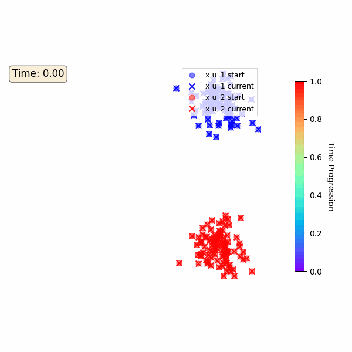
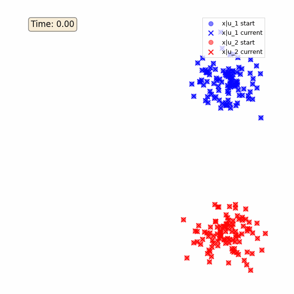
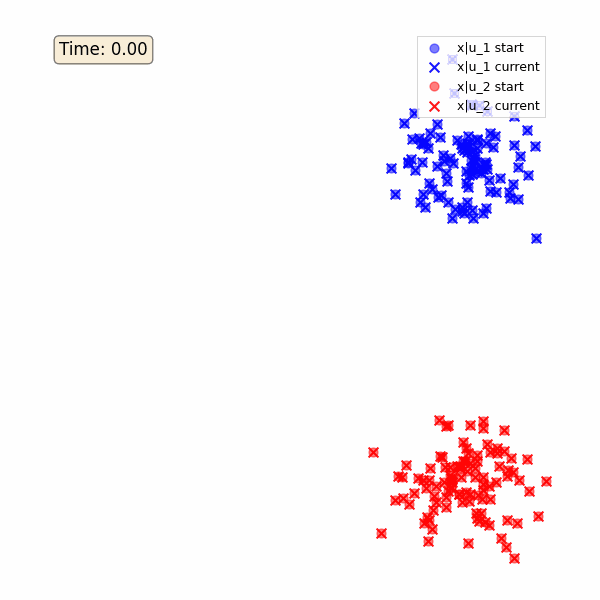

# Diversified Flow Matching

This repository contains code for ["Diversified Flow Matching with Translation Identifiability,"](https://openreview.net/pdf?id=P0zvNhHGG9) published in ICML 2025.
Diversified Flow Matching (DFM) extends flow matching to handle multiple conditional distributions simultaneously while maintaining translation identifiability.


<div align="center">
<table width="100%">
<tr>
<td align="center" colspan="2">
<strong>DFM</strong> <em>(Proposed, learned interpolants)</em>
</td>
</tr>
<tr>
<td align="center" width="50%">

</td>
<td align="center" width="50%">

</td>
</tr>

<tr>
<td align="center" colspan="2">
<strong>FM</strong> <em>(with conditional coupling)</em>
</td>
</tr>
<tr>
<td align="center" width="50%">

</td>
<td align="center" width="50%">

</td>
</tr>

<tr>
<td align="center" colspan="2">
<strong>FM-OT</strong> <em>(with conditional OT coupling)</em>
</td>
</tr>
<tr>
<td align="center" width="50%">

</td>
<td align="center" width="50%">

</td>
</tr>

</table>
</div>

## 2D/3D Data
This section provides demonstrations of the proposed Diversified Flow Matching (DFM) framework, comparing it against baseline flow matching methods.

### Setup
The following Python packages are required:
- torchcfm
- PyTorch
- matplotlib
- numpy
- tqdm
- wandb (for logging, optional)
- plotly (for interactive 3D visualizations, optional)
- imageio (for rotation GIFs, optional)

### Method Comparison

- **DFM (Diversified Flow Matching)**: Our proposed method with parametric interpolants and collision penalty
- **FM (Flow Matching)**: Standard flow matching with linear interpolants  
- **FM-OT (Flow Matching + Optimal Transport)**: Linear interpolants with optimal transport coupling
- **FM-Cond (Conditional Flow Matching)**: Conditional flow matching baseline

<!-- ### Trajectory Animation Gallery

The demonstrations show particle flows between two Gaussian mixtures with different conditional labels. Rainbow-colored trajectories indicate time progression from blue (t=0) to red (t=1). The colorbar (shown only in DFM) illustrates the temporal evolution. -->


<!-- **Key Observations:**
- **FM**: Direct linear paths may lead to particle collisions
- **FM-OT**: Optimal transport reduces collisions but uses linear interpolants  
- **DFM**: Learns smooth, collision-avoiding trajectories with parametric interpolants -->

### Running the Demonstrations

Generate your own trajectory animations with different methods:

#### 2D Demonstrations
```bash
cd synthetic

# DFM (our method)
python synthetic_demo.py --method dfm --config 2d --create_animations

# Standard Flow Matching
python synthetic_demo.py --method fm --config 2d --create_animations

# Flow Matching + Optimal Transport
python synthetic_demo.py --method fm_ot --config 2d --create_animations
```

#### 3D Demonstrations
```bash
cd synthetic

# DFM (our method)
python synthetic_demo.py --method dfm --config 3d --create_animations

# Standard Flow Matching
python synthetic_demo.py --method fm --config 3d --create_animations

# Flow Matching + Optimal Transport
python synthetic_demo.py --method fm_ot --config 3d --create_animations
```

### Output Structure

All visualizations are saved to organized directories:
```
synthetic/results/
├── dfm_dim2_seed42/
│   ├── final_test_2d_animation.gif
│   ├── final_test_2d_static.png
│   └── final_metrics.txt
├── dfm_dim3_seed42/
│   ├── final_test_3d_animation.gif
│   ├── final_test_3d_rotation.gif
│   └── final_metrics.txt
└── ... (other methods)
```

<!-- ### Features

- **🎬 Animated Trajectories**: Beautiful rainbow-colored trajectories showing time evolution
- **📊 Interactive 3D**: Plotly-based interactive visualizations with play/pause controls
- **🔄 Rotation Views**: 360° rotating perspectives of 3D trajectories
- **📈 Performance Metrics**: Translation error and Earth Mover's Distance evaluation
- **⚡ Optimized Rendering**: Fast animation generation with smart subsampling -->


## Real Data Experiments

<p align="center">
  
</p>

### Dataset Setup
Download the CelebA-HQ dataset from [here](https://www.kaggle.com/datasets/badasstechie/celebahq-resized-256x256) and the Bitmoji dataset from [here](https://www.kaggle.com/datasets/mostafamozafari/bitmoji-faces). The dataset is expected to be in the following structure:

```
image_translation/data
    /celebahq2bitmoji
        /trainA
        /trainB
        /testA
        /testB
        /trainA_attr.csv
        /trainB_attr.csv
        /testA_attr.csv
        /testB_attr.csv
```
The attribute files contain the following columns:
- `Male`: 1 if the image is of a male, -1 otherwise

Please change the configs/images/celebahq2bitmoji/celebahq2bitmoji.py to match the path of your dataset.

### Running Experiments

#### Training
To run image translation with CelebA-HQ to Bitmoji experiments, use:

```bash
python train.py --config configs/celebahq2bitmoji/dfm.py
```

The FID is evaluated periodically during training, and the source-translated image pairs are logged to wandb.

#### Evaluation Only
To run evaluation only (without training), use:

```bash
python train.py --config configs/celebahq2bitmoji/dfm.py --mode eval
```

This will:
1. Load the latest checkpoint from the work directory
2. Generate translations for all test images
3. Save the results to `eval/{config_name}.pkl`
4. Exit without performing any training

The evaluation mode uses the `--mode eval` flag directly (instead of modifying config flags) and is useful for:
- Generating final results for paper/report figures
- Testing model performance on held-out data
- Creating visualizations without retraining


If you like our work, please consider citing:

```
@inproceedings{
  title={Diversified Flow Matching with Translation Identifiability},
  author={Shrestha, Sagar and Fu, Xiao},
  booktitle={International Conference on Machine Learning (ICML)},
  year={2025}
}
```


